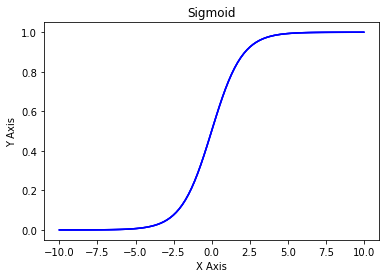
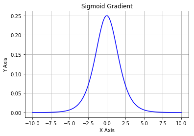

```python
import numpy as np
import matplotlib.pyplot as plt
```

## Sigmoid function

$sigmoid(x) = \frac{1}{1+e^{-x}}$ is also known as the logistic function. 


```python
def sigmoid(x):
    """
    Given a scalar x
    compute sigmoid of x
    """
    sx = 1/(1+np.exp(-x))
    
    return sx
```


```python
sigmoid(1)
```


    0.7310585786300049


```python
xArray = np.array([-1,0,1,2])
sigmoid(xArray)
```


    array([ 0.26894142,  0.5       ,  0.73105858,  0.88079708])


```python
x=np.linspace(-10,10,100)
plt.plot(x,sigmoid(x),'b', label='linspace(-10,10,100)')
plt.grid()
plt.xlabel('X Axis')
plt.ylabel('Y Axis')
plt.title('Sigmoid')

plt.show()
```





## Sigmoid Gradient

Gradient is also called the slope or derivative.

The formula of sigmoid gradient is: 
$$sigmoid\_grad(x) = \sigma'(x) = \sigma(x) (1 - \sigma(x))\tag{2}$$


```python
def sigmoid_grad(x):
    sx = sigmoid(x)
    ds = sx*(1-sx)
    
    return ds

sigmoid_grad(xArray)
```


    array([ 0.19661193,  0.25      ,  0.19661193,  0.10499359])


```python
x=np.linspace(-10,10,100)
plt.plot(x,sigmoid_grad(x),'b', label='linspace(-10,10,100)')
plt.grid()
plt.xlabel('X Axis')
plt.ylabel('Y Axis')
plt.title('Sigmoid Gradient')

plt.show()
```





```python

```
