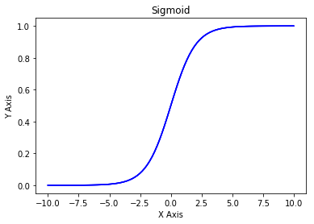
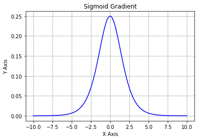

## Logistic Regression

For binary classification, we want $\hat{y}$(`y_hat`) to be the chance that y equals to 1. 

Linear function like $\hat{y}=W^Tx+b$ does not work because $W^Tx+b$ can be out of the range of [0,1].

In logistic regression, $\hat{y}=\sigma(W^Tx+b)$

where `W` is an $n_x$ dimensional vector, `b` is a real number


## Cost Function

To train the parameters `W` and `b` of the logistic regression model, we need a cost function to measure how well the current algorithm is doing on the entire training set.

So the cost function applied to parameters W and b is going to be $J(W,b)=\frac{1}{m}\sum_{i=1}^{m}L(\hat{y},y)$.

$L(\hat[y],y)$ refers to the loss function, which measures how well we are doing on one individual training sample. We don't use squred error $L(\hat{y},y)=(y-\hat{y})^2$ because it leads to an optimization problem that is non-convex. So gradient descent may not find the global optimum.

Instead, we define loss function as $L(\hat{y},y)=-(y\log\hat{y}+(1-y)\log(1-\hat{y}))$.

## Sigmoid Function in Detail

```python
import numpy as np
import matplotlib.pyplot as plt
```

## Sigmoid function

$sigmoid(x) = \frac{1}{1+e^{-x}}$ is also known as the logistic function. 


```python
def sigmoid(x):
    """
    Given a scalar x
    compute sigmoid of x
    """
    sx = 1/(1+np.exp(-x))
    
    return sx
```


```python
sigmoid(1)
```


    0.7310585786300049


```python
xArray = np.array([-1,0,1,2])
sigmoid(xArray)
```


    array([ 0.26894142,  0.5       ,  0.73105858,  0.88079708])


```python
x=np.linspace(-10,10,100)
plt.plot(x,sigmoid(x),'b', label='linspace(-10,10,100)')
plt.grid()
plt.xlabel('X Axis')
plt.ylabel('Y Axis')
plt.title('Sigmoid')

plt.show()
```





## Sigmoid Gradient

Gradient is also called the slope or derivative.

The formula of sigmoid gradient is: 
$$sigmoid\_grad(x) = \sigma'(x) = \sigma(x) (1 - \sigma(x))\tag{2}$$


```python
def sigmoid_grad(x):
    sx = sigmoid(x)
    ds = sx*(1-sx)
    
    return ds

sigmoid_grad(xArray)
```


    array([ 0.19661193,  0.25      ,  0.19661193,  0.10499359])


```python
x=np.linspace(-10,10,100)
plt.plot(x,sigmoid_grad(x),'b', label='linspace(-10,10,100)')
plt.grid()
plt.xlabel('X Axis')
plt.ylabel('Y Axis')
plt.title('Sigmoid Gradient')

plt.show()
```





```python

```
